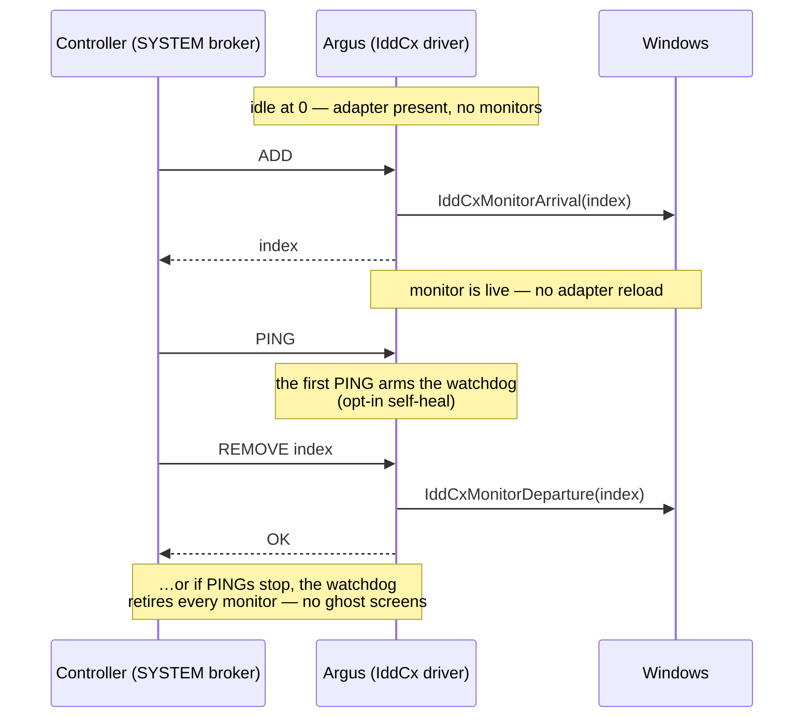
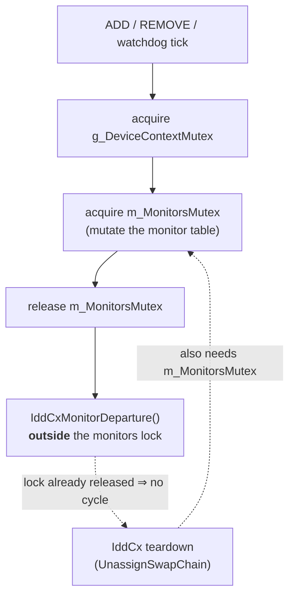

# Argus

### A Windows virtual display that appears and disappears on demand — one live API call, no adapter reload.

**An open-source Indirect Display Driver (IddCx) by [Gred In Labs Technologies](https://github.com/GredInLabsTechnologies)**

---

## What it is

Argus turns a Windows PC into a machine that can grow a **real extra monitor out of thin air** — no
cable, no hardware, no second GPU output. The monitor behaves exactly like a physical one (Windows can
extend the desktop to it, drag windows onto it, set its resolution), except it lives entirely in
software and can be **summoned and dismissed instantly**.

It is the virtual-display engine behind the **Istro** project, where that on-demand monitor is streamed
over Wi‑Fi to a tablet — so any screen you have lying around becomes a true second display for your PC,
appearing the moment you connect and vanishing the moment you leave.

## Why it exists — what makes it different

Argus is a fork of the excellent [VirtualDrivers/Virtual-Display-Driver](https://github.com/VirtualDrivers/Virtual-Display-Driver)
(MttVDD). The upstream is a fantastic, widely-used VDD — but it follows a **fixed-count-at-boot** model:
you declare how many virtual monitors exist, and changing that count means **reloading the whole
adapter**. That's a visible, disruptive operation.

Argus rebuilds the lifecycle around a **spacedesk-style on-demand model**:

- **Idle at zero.** The adapter is always present but starts with **0 monitors**. It costs nothing and
  clutters nothing until something actually asks for a screen.
- **Add / remove one monitor by index, live.** A controller asks for a monitor and one **arrives live**
  via a single `IddCxMonitorArrival` call; it asks to release it and it **departs** via
  `IddCxMonitorDeparture` — **with no adapter reload**, no flicker on your other displays, no
  re-enumeration storm.
- **Self-healing.** A tiny control protocol (`ADD` → index, `REMOVE <index>` → ok, `PING` → pong) drives
  it. If the controller crashes and stops pinging, a watchdog auto-retires the orphaned monitors so you
  never end up with ghost screens — yet a standalone install with no controller keeps its monitors
  forever. Opt-in robustness, no surprises.

### The control loop

A SYSTEM-only named pipe (`\\.\pipe\ArgusDisplay`, SDDL locked to SYSTEM + Administrators) carries the
whole protocol. The adapter sits at zero monitors until something asks:

## The hard part (the part we're proud of)

Hot-plugging monitors *correctly* on IddCx is genuinely tricky, because the framework's teardown path
(`UnassignSwapChain`) and the driver's own monitor lock can **deadlock each other** if you're naïve
about it. Argus calls `IddCxMonitorDeparture` **outside** the monitors lock and keeps a strictly
**acyclic lock order** (`device → monitors`, departure outside the lock), documented right in the code.
The result is add/remove that's instant *and* free of the self-deadlock this API invites. The control
pipe is also hardened (SDDL restricted to SYSTEM + Administrators, not "Everyone").

The order is strictly **`g_DeviceContextMutex → m_MonitorsMutex`**, and `IddCxMonitorDeparture` is the
one call deliberately made *after* releasing the monitors lock — because the framework's own teardown
(`UnassignSwapChain`) reaches back for that same lock. Release first, then depart: no cycle, no hang.

This is the kind of detail that doesn't show up in a screenshot but is the difference between a demo and
something you'd actually run.

## Building

Argus is a user-mode UMDF/IddCx driver. It builds with the **Enterprise WDK (EWDK)** without installing
Visual Studio, or in CI via the public [GitHub Actions workflow](.github/workflows/ci-validation.yml)
(reproducible from source). Build notes live in [`docs/`](docs/).

## Code signing policy

Release binaries are signed with **Authenticode (OV)** via **SignPath Foundation**, so a signed build
loads without enabling test-signing on x64. Argus is user-mode (UMDF/IddCx), so it does **not** require
kernel attestation/EV.

**Current status:** the `v0.1.0` pre-release is **unsigned** — it is the artifact SignPath will sign; an
installable, signed release follows once SignPath approves. The installer detects an unsigned build and
explains, rather than failing cryptically.

- **Roles.** The committers, reviewers and approvers for this project are the **Gred In Labs
  Technologies** maintainers. Every signing request requires explicit manual maintainer approval —
  there is no automatic/unattended signing.
- **Privacy.** Argus does **not** collect, transmit, or process any personal data.

Full policy and verification steps: [`docs/CODE-SIGNING-POLICY.md`](docs/CODE-SIGNING-POLICY.md) and
[`docs/SIGNING.md`](docs/SIGNING.md).

## Credits & attribution

Argus stands on excellent shoulders, and we keep the credit where it belongs:

- **[VirtualDrivers/Virtual-Display-Driver](https://github.com/VirtualDrivers/Virtual-Display-Driver)**
  ([MikeTheTech](https://github.com/itsmikethetech), [Jocke](https://github.com/zjoasan) and
  contributors) — the upstream MttVDD that Argus forks. HDR, EDID, the core IddCx driver: theirs.
- **[SudoMaker / SudoVDA](https://github.com/SudoMaker)** — the on-demand add/remove-by-index pattern
  that inspired Argus's runtime model (MIT/CC0).
- **[Microsoft IndirectDisplay sample](https://github.com/microsoft/Windows-driver-samples/tree/master/video/IndirectDisplay)**
  — the IddCx foundation.

What Gred In Labs adds: the **idle-at-0 + live, deadlock-free, per-index monitor hotplug**, the hardened
control protocol with watchdog self-heal, and the integration as Istro's virtual-display engine.

## License

[MIT](LICENSE). Upstream copyright (© 2024 Virtual Display) is preserved; Argus modifications © 2026
Gred In Labs Technologies. A fork that honors the original.

---

Free code signing on Windows provided by <a href="https://signpath.io">SignPath.io</a>, certificate by <a href="https://signpath.org">SignPath Foundation</a>.

